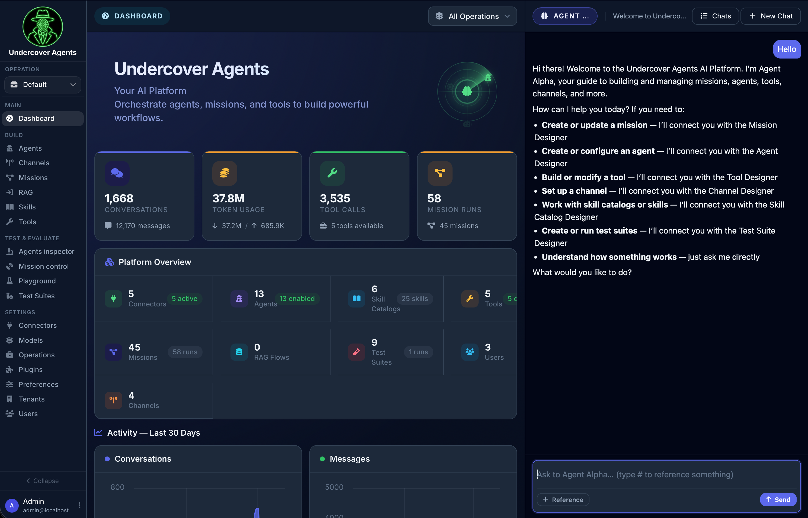

# Undercover Agents

<p align="center">
	
</p>

<p align="center">
	<a href="https://github.com/undercoveragents/undercoveragents/actions/workflows/ci.yml"></a>
	<a href="https://codecov.io/gh/undercoveragents/undercoveragents"></a>
	<a href="https://www.ruby-lang.org/"></a>
	<a href="https://rubyonrails.org/"></a>
	<a href="LICENSE.md"></a>
</p>

Undercover Agents is an open-source, multi-tenant AI platform for building, operating, and publishing agentic systems from a Rails application.

It is designed for teams that want more than a thin SDK. You can configure agents, orchestrate workflows, connect external systems, package reusable knowledge, and expose the result through branded chat or API channels, all inside the same product.

<p align="center">
	
</p>

## What You Can Build

- AI agents with tools, subagents, skills, and optional capabilities
- Visual workflows called Missions for multi-step LLM and automation pipelines
- Retrieval and knowledge experiences backed by RAG flows and skill catalogs
- Internal pilots, AI assistants, and customer-facing chat experiences
- Published agent or mission endpoints through web, API, and external channels

## Highlights

- Multi-tenant by design, with workspace-style Operations inside each tenant
- Visual mission designer for orchestrating prompts, APIs, tools, control flow, and outputs
- Plugin-first architecture for connectors, tools, channels, capabilities, web-search clients, and RAG modules
- Builtin product-manual skill catalogs for admin, agents, missions, channels, test suites, skills, tools, and RAG
- Built-in admin assistant, playground, inspector, API docs, and job dashboard
- Client chat channels can customize per-message action icons, including copy/retry controls and optional assistant feedback with hover-or-always visibility
- Agent Alpha can now inspect agent chat history and run synchronous debug prompts against agents through the agent-designer runtime tools, using the same persisted chats/messages the inspector shows.
- Rails-native stack with Hotwire, Haml, Tailwind, Solid Queue, and Falcon

## LLM Providers Support

Undercover Agents is built on [ruby_llm](https://github.com/crmne/ruby_llm), so it supports the providers available through that runtime, including OpenAI, xAI, Anthropic, Gemini, Vertex AI, Bedrock, DeepSeek, Mistral, Ollama, OpenRouter, Perplexity, GPUStack, and any OpenAI-compatible API.

## Core Concepts

| Concept | What it means |
| --- | --- |
| Tenant | The top-level isolation boundary for users, operations, connectors, and preferences |
| Operation | A workspace inside a tenant that scopes agents, missions, tools, skill catalogs, RAG flows, and channels |
| Agent | A configurable LLM-backed assistant with tools, skills, subagents, and capabilities |
| Mission | A visual workflow for orchestrating multi-step AI or automation behavior |
| Connector | A connection to an external provider or system |
| Tool | A runtime ability exposed to agents or missions |
| Skill Catalog | A library of packaged knowledge that agents can activate on demand |
| Channel | A published invocation surface for agents or missions |

## Tech Stack

- Ruby 4.0.4
- Rails 8.1
- Falcon application server
- PostgreSQL
- Haml views
- Tailwind CSS v4
- Hotwire: Turbo + Stimulus
- Importmap for JavaScript delivery
- React + React Flow for the mission designer
- Solid Queue + Mission Control Jobs
- RSpec, Capybara, RuboCop, haml-lint, Brakeman, bundler-audit

## Getting Started

### Prerequisites

- Ruby 4.0.4
- PostgreSQL running locally with the pgvector `vector` extension available
- Bundler
- Node.js and `pnpm` (via Corepack or a local install)

Most integrations are optional. You can boot the app locally without configuring an LLM provider, but AI features that depend on a default model will stay unavailable until you add one.

### 1. Install Dependencies

```bash
git clone https://github.com/undercoveragents/undercoveragents.git
cd undercoveragents
bundle install
pnpm install
```

### 2. Prepare the App

```bash
bin/setup --skip-server
```

This installs missing gems if needed, prepares the database, and clears old logs and temp files.

### 3. Start the Development Stack

```bash
bin/dev
```

This starts:

- Falcon on `http://localhost:3000`
- Tailwind watcher
- Mission designer JavaScript watcher
- Solid Queue worker

### 4. Sign In

After setup, the app seeds a default system administrator account:

- Email: `admin@localhost`
- Password: `Changeme123!`

The bootstrap flow also creates a default tenant plus its two core operations:

- `Headquarter`
- `Default`

Use the shared sign-in page at `/login` for local sign-in

### 5. Configure Your First Model Provider

To enable the full AI feature set:

1. Go to Admin -> Connectors and add an LLM provider.
2. Go to Admin -> Preferences and select the default model.
3. Create or edit an agent and start testing in Playground.

### 6. First Things To Try

1. Create an agent and open it in Playground.
2. Build a Mission with an input node, an LLM node, and an output node.
3. Add a tool backed by a connector.
4. Create a skill catalog and attach it to an agent.
5. Publish an experience through a channel.

## Repository Guide

```text
app/         Rails application code
config/      Rails configuration, routes, initializers, builtin agents and skills
db/          Schema, migrations, seeds, queue schema
plugins/     Plugin-based extensions for connectors, tools, channels, capabilities, and RAG modules
spec/        Test suite
website/     VitePress marketing site
```

## Extensibility

Undercover Agents is intentionally plugin-oriented. The application already uses that pattern internally for:

- connectors
- tools
- channels
- capabilities
- RAG modules

If you want to add a new integration or runtime surface, `plugins/` is usually the right place to start.

## Contributing

Issues and pull requests are welcome.

Before opening a PR, run:

```bash
bundle exec rake
```

## Project Status

Undercover Agents is under active development. The core product is usable today, but some extension points and internal APIs may continue to evolve as the open-source release matures.

## Acknowledgements

Special mention to [ruby_llm](https://github.com/crmne/ruby_llm), whose beautiful and easy-to-use API made this project possible.

## License

Project by Mirko Mignini. Open sourced under the Apache 2.0 License. See [LICENSE.md](LICENSE.md).
